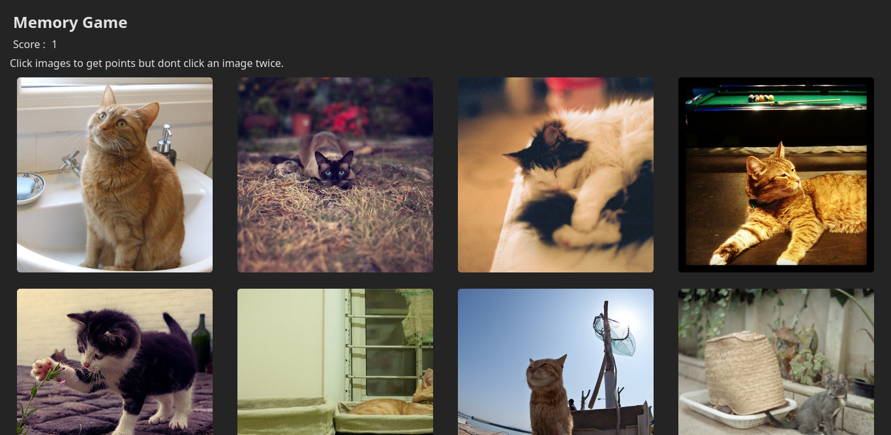

# React memory game

Live website can be found [here](https://golam71.github.io/odin-memory-card/)

It uses `useEffect` to fetch data from [thecatapi.](https://thecatapi.com/) after that it shows cards. You click as many cards as possible but never duplicate ones. There are 16 cards hence 16 points to get. `useState` was used for updating data.

After you do click a card it checks if that card was clicked before. `URL` is the unique key here.

When you click an image the image dir is shuffled using [Fisher–Yates shuffle](https://en.wikipedia.org/wiki/Fisher%E2%80%93Yates_shuffle.) Then [Framer Motion](https://motion.dev/) is used to animate the images moving. 

